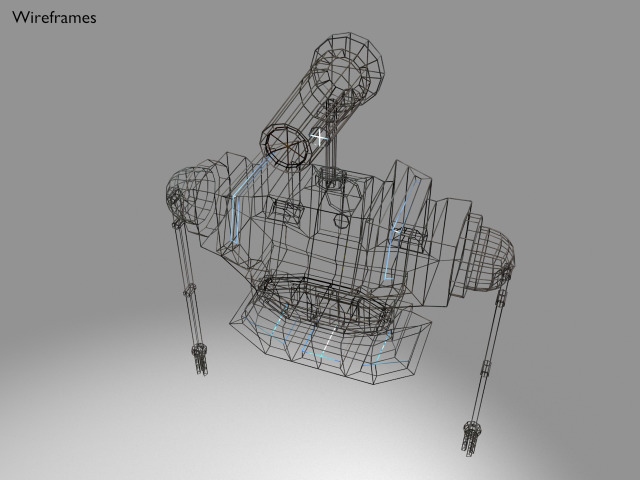

Workbot
===





License
===

```
© 2016 Mark Raynsford <visual@io7m.com>

This work is licensed under a Creative Commons Attribution 4.0
International License.

You should have received a copy of the license along with this
work. If not, see <http://creativecommons.org/licenses/by/4.0/>.

```

Scene statistics
===

```
Mesh: arm_L_mesh
  Polygons: 500
  Textures:
    Image: robot.svg.png 1024x1024
    Image: robot_emission.png 1024x1024

Mesh: arm_R_mesh
  Polygons: 500
  Textures:
    Image: robot.svg.png 1024x1024
    Image: robot_emission.png 1024x1024

Mesh: head_mesh
  Polygons: 288
  Textures:
    Image: robot.svg.png 1024x1024
    Image: robot_emission.png 1024x1024

Mesh: torso_mesh
  Polygons: 984
  Textures:
    Image: robot.svg.png 1024x1024
    Image: robot_emission.png 1024x1024

```

